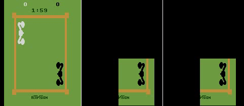
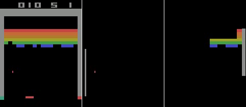
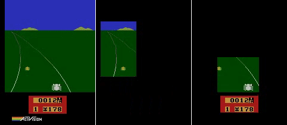
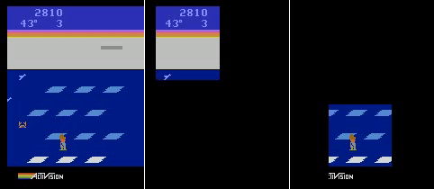
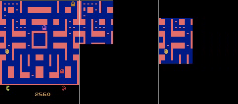
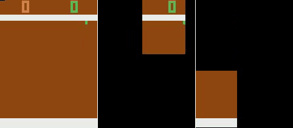
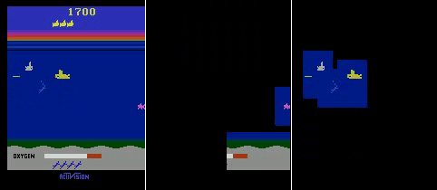
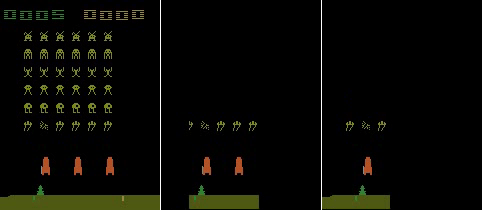

# Learn to Interpret Atari Agents
> Paper link [Learn to Interpret Atari Agents](https://arxiv.org/abs/1812.11276). *Zhao Yang, Song Bai, Li Zhang, Philip H.S. Torr*. December 2018.

<p align="center">   </p>

<p align="center">   
</p>


## Abstract
Deep Reinforcement Learning (DeepRL) agents surpass human-level performances in a multitude of tasks. However, the direct mapping from states to actions makes it hard to interpret the rationale behind the decision making of agents. In contrast to previous *a-posteriori* methods of visualizing DeepRL policies, we propose an end-to-end trainable framework based on Rainbow, a representative Deep Q-Network (DQN) agent. Our method automatically learns important regions in the input domain, which enables characterizations of the decision making and interpretations for non-intuitive behaviors. Hence we name it Region Sensitive Rainbow (RS-Rainbow). RS-Rainbow utilizes a simple yet effective mechanism to incorporate visualization ability into the learning model, not only improving model interpretability, but leading to improved performance. Extensive experiments on the challenging platform of Atari 2600 demonstrate the superiority of RS-Rainbow. In particular, our agent achieves state of the art at just 25% of the training frames.

## Installation
Install dependencies via Anaconda
```
conda env create -f environment.yml
```
Activate the environment
```
source activate RS-Rainbow
```
## Training
Train RS-Rainbow with softmax normalization and default settings
```
python main.py
```
Train RS-Rainbow with sigmoid normalization, on game ms_pacman, for a maximum 200 million environment steps
```
python main.py --model-type='DQN_sig' --game='ms_pacman' --T-max=200000000
```
The list of available games is [here](https://github.com/openai/atari-py/tree/master/atari_py/atari_roms). Valid values for the `--model-type` argument are 'DQN', 'DQN_rs', and 'DQN_rs_sig', corresponding to models Rainbow, RS-Rainbow with softmax normalization, and RS-Rainbow with sigmoid normalization in the paper. The default is 'DQN_rs'.

## Testing
Evaluate a trained RS-Rainbow agent. Specify the model weights directory with `--model` and the number of test episodes with `--evaluation-episodes`. Use `--game` and `--model-type` accordingly. 
```
python main.py --evaluate --evaluation-episodes=200 --model='./results/ms_pacman_DQN_rs_model.pth'
```

## Citation
If you find the code useful, please consider citing the following paper.

    @article{rs-rainbow,
      title={Learn to Interpret Atari Agents},
      author={Yang, Zhao and Bai, Song and Zhang, Li and Torr, Philip HS},
      journal={arXiv preprint arXiv:1812.11276},
      year={2018}
    }
    
If you encounter any problems or have any inquiries, please contact us at zhao.yang@chch.ox.ac.uk.

## Acknowledgement
We thank the authors of this [repository](https://github.com/Kaixhin/Rainbow) for making their implementation of Rainbow publicly available. Our code is adapted from their implementation.
